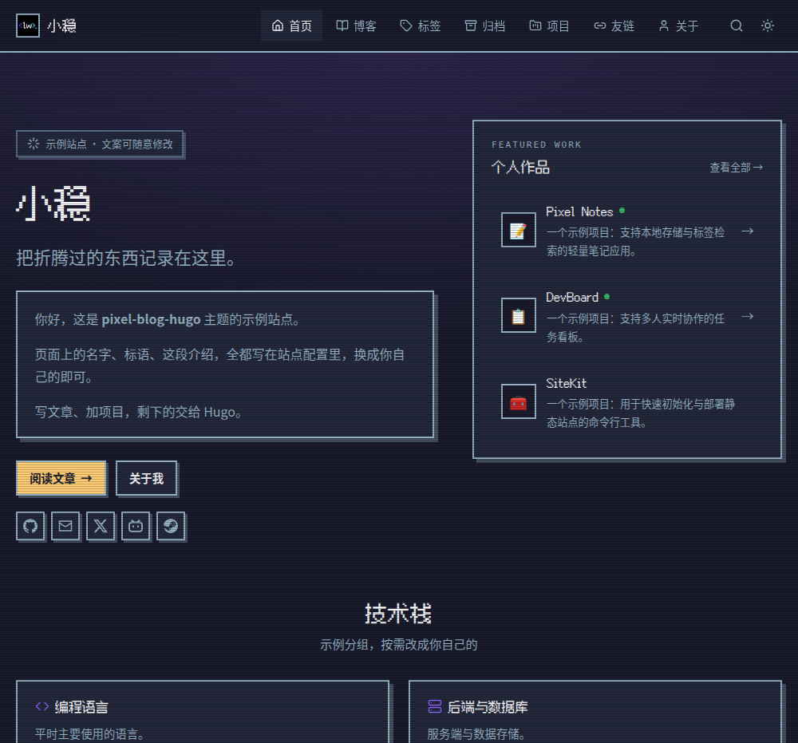
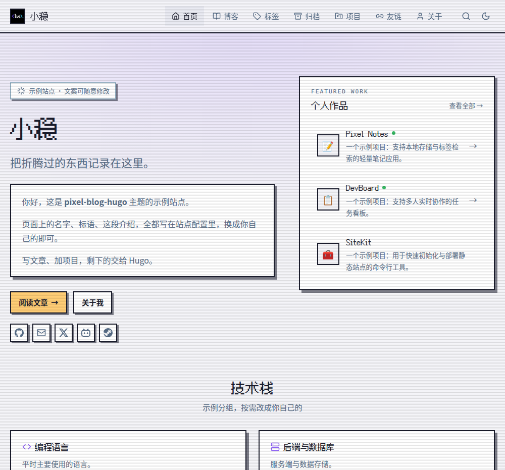
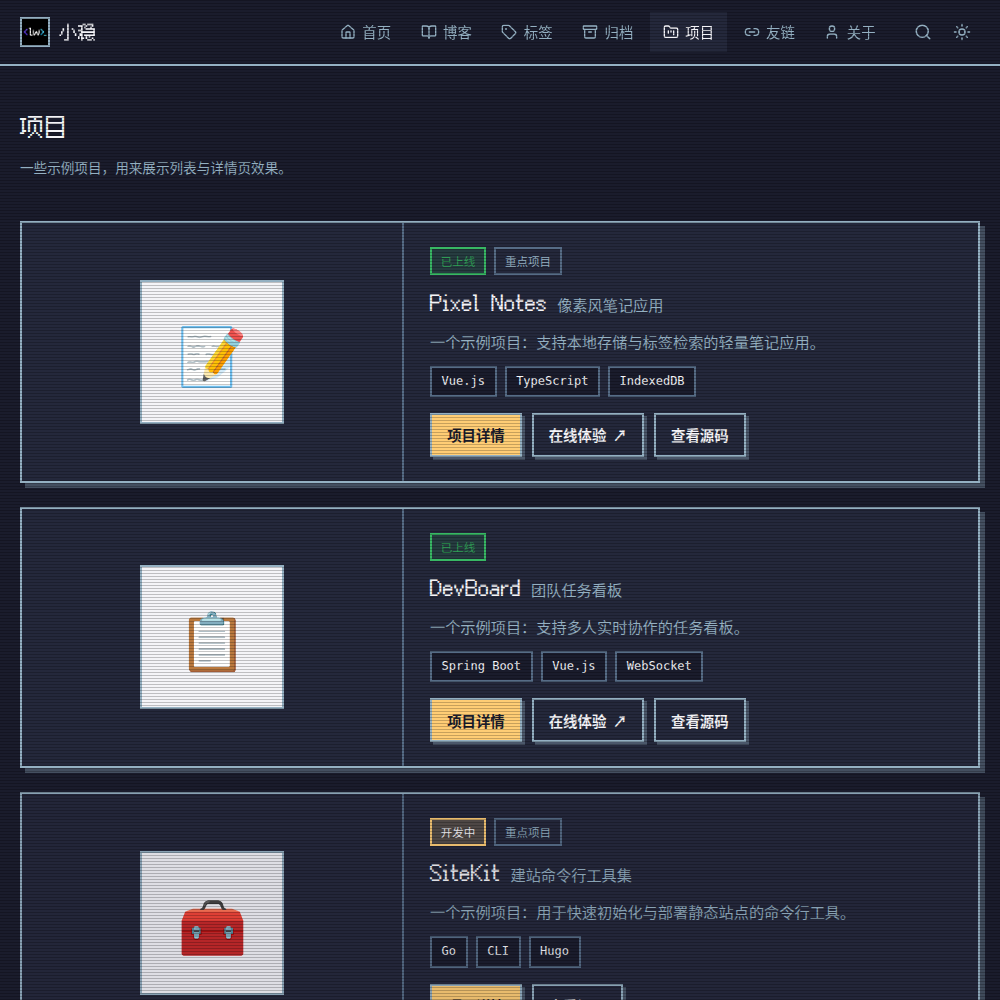
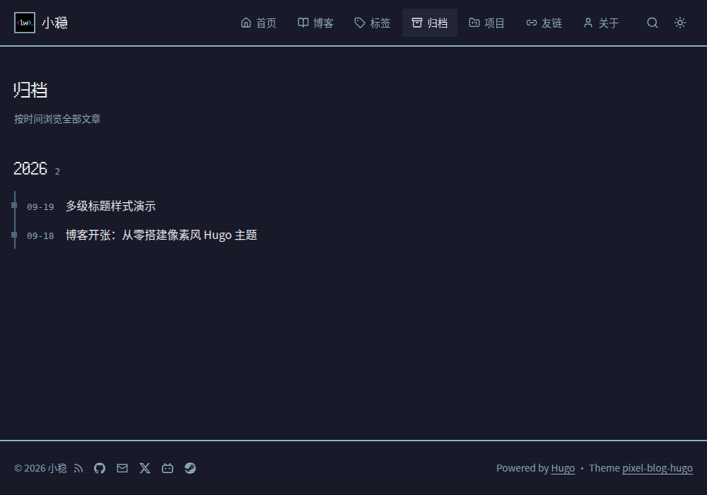
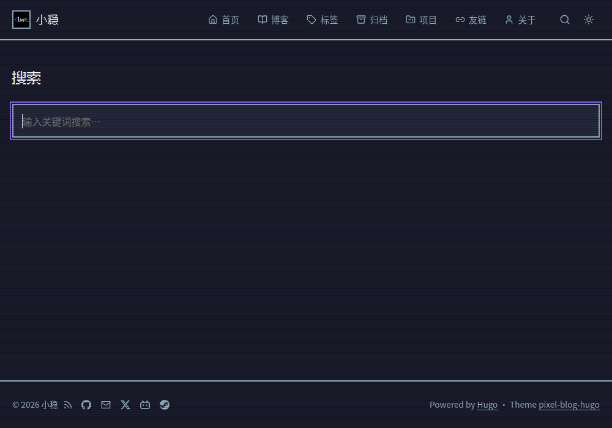
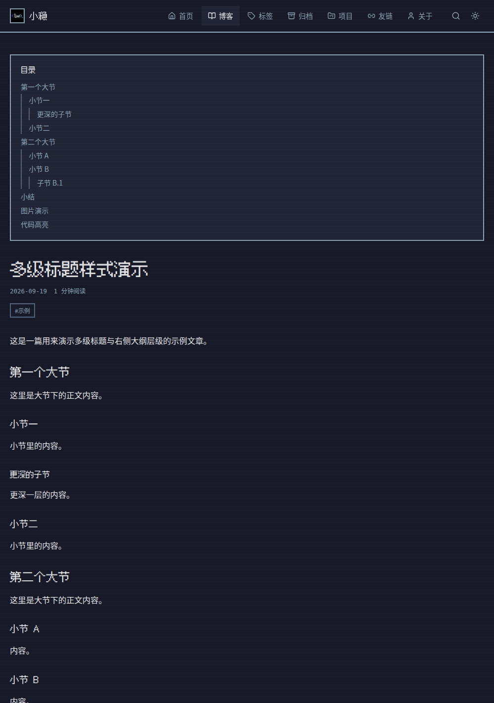
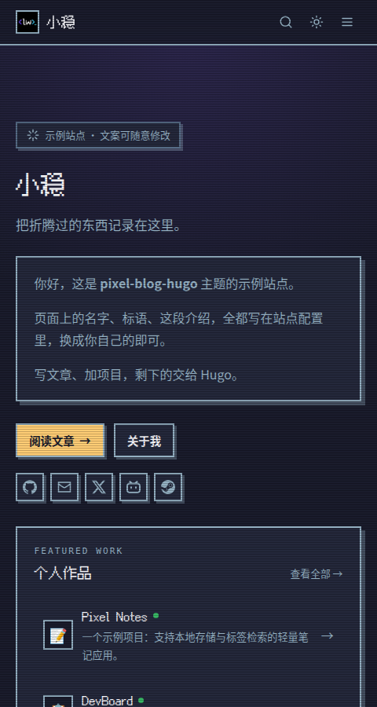

# pixel-blog-hugo

个人博客 Hugo 主题：像素复古（pixel / 8-bit）风格，零圆角、2px 硬边框、实心错位阴影，配色取自 Sweetie 16 像素画调色板，明暗双主题。

[English](README.en.md)

| 首页 · 亮色 | 首页 · 暗色 |
|---|---|
|  |  |

| 项目 | 归档 | 搜索 |
|---|---|---|
|  |  |  |

| 文章 | 移动端 |
|---|---|
|  |  |

## 特性

- 明暗主题切换，跟随系统，无闪烁（FOUC）
- 响应式布局 + 移动端折叠菜单，全站移动端适配
- 首页：双栏 Hero、个人信息面板、个人作品入口、技术栈（可开关）、最新文章
- **项目（`/projects/`）**：内容驱动，大卡片列表 + 站内详情页；`online: true` 的项目带绿点与悬浮效果、可显示「在线体验」
- 顶部导航、友链页（`/links/`）均由配置驱动，**注释掉某项即隐藏**
- 可选 **CRT 扫描线**（`params.scanlines`）、页脚 **ICP 备案号**（`params.icp`）、**社交图标**（`params.social`）
- **首页文案 / 顶部栏名称与 logo / 技术栈 / 友链，写在你站点的配置里（覆盖主题默认）**
- 文章 / 项目页：**右侧粘性目录（大纲）**、标签、上一篇/下一篇、**代码块一键复制**、**相关文章**（窄屏目录回到内容上方）
- **Markdown 渲染钩子**：图片懒加载 + 响应式 `srcset` + 图注、外链自动新窗口、标题锚点链接
- **站内搜索**（覆盖文章与项目，纯前端、无外部依赖）
- 标签云与标签页、**归档页**（按年份分组）、**404 页面**、robots.txt、页脚 **RSS 订阅**图标
- SEO：JSON-LD（BlogPosting / 面包屑）、OG / Twitter 分享图（站点默认 + 文章封面）、description / canonical、RSS、sitemap
- 无障碍：跳过导航（skip link）、统一焦点样式、分页按钮可访问名称
- CSS 自定义属性驱动，改一个色值全站生效
- 样式与脚本经 Hugo Pipes 拼接、压缩、加指纹，无需 npm / 构建工具
- i18n 中英文案（含代码复制提示、社交链接等）

## 快速开始

### 1. 安装 Hugo → 建站 → 装主题

> 需要 **Hugo ≥ 0.146**（extended 非必需）。用 `hugo version` 确认版本。

```bash
# 1) 安装 Hugo（extended 更佳，本主题非必需；按系统选一条执行）
brew install hugo                       # macOS（Homebrew）
winget install Hugo.Hugo.Extended       # Windows（PowerShell）
sudo apt install hugo                   # Ubuntu / Debian
sudo snap install hugo                  # 其它 Linux（或到 github.com/gohugoio/hugo/releases 下载）
hugo version                            # 确认安装成功

# 2) 建站
hugo new site my-blog
cd my-blog
git init

# 3) 安装主题（submodule）
git submodule add https://github.com/LittleWin8/pixel-blog-hugo themes/pixel-blog-hugo
# 或者用 Hugo Modules：
#   hugo mod init github.com/<你的用户名>/my-blog
#   hugo mod get github.com/LittleWin8/pixel-blog-hugo
```

### 2. 配置 `hugo.toml`

只需基础配置（其余个性化见下节）：

```toml
baseURL = "https://example.com/"
languageCode = "zh-cn"
defaultContentLanguage = "zh"
title = "我的博客"
theme = "pixel-blog-hugo"
enableRobotsTXT = true
hasCJKLanguage = true      # 中文站点建议开启（阅读时长/摘要更准）
summaryLength = 80         # 以上三行均为示例值，按需调整
# enableGitInfo = true     # 自动用 Git 提交时间作为「更新于」，见下文

[outputs]
  home = ["HTML", "RSS", "JSON"]   # JSON 供站内搜索使用

[pagination]
  pagerSize = 8
[taxonomies]
  tag = "tags"
[markup]
  [markup.goldmark.parser]
    wrapStandAloneImageWithinParagraph = false   # 图片渲染钩子输出 <figure>，避免被包进 <p>
  [markup.goldmark.renderer]
    unsafe = true
  [markup.highlight]
    noClasses = false
  [markup.tableofcontents]     # 右侧大纲层级范围
    startLevel = 2
    endLevel = 4
```

### 3. 写内容与预览（三系统命令相同）

```bash
hugo new posts/hello.md        # 文章，发布前把 draft 改 false
hugo new projects/my-app.md    # 项目（字段见「项目」一节）
hugo new about.md              # 关于页：首页 Hero 的「关于我」按钮指向 /about/

hugo server -D                 # 本地预览 http://localhost:1313
hugo                           # 构建到 public/，部署到任意静态托管
```

> 首页 Hero 固定有一个「关于我 →」按钮（指向 `/about/`）。若不想用它，删除 `content/about.md` 并在站点覆盖 `params.hero` 或直接改主题 `layouts/partials/hero.html`（进阶）。

> 搜索页需要站点有 `content/search.md`（`layout: search`）并开启 `home` 的 JSON 输出。

> 文章/项目等**内容不在主题里**，而是放在**站点**的 `content/` 下。主题的**目录结构、改配色/字体/断点等开发向说明见 [CONTRIBUTING.md](CONTRIBUTING.md)**。

## 个性化配置

记住一句话：**改你自己的博客，只动你自己站点里的文件，基本不用碰主题**：

| 想改什么 | 去改哪个文件 |
|---|---|
| 名字、logo、首页文案、技术栈、友链、导航、开关 | **你站点根目录的 `hugo.toml`** 里的 `[params]`（照下方示例填） |
| 文章 | 你站点的 `content/posts/` |
| 项目 | 你站点的 `content/projects/` |
| 主题默认值 / 外观 / 功能（进阶） | 主题的 `hugo.yaml`、`assets/`、`layouts/`，见 [CONTRIBUTING.md](CONTRIBUTING.md) |

> 站点配置文件叫 `hugo.toml` 或 `hugo.yaml` 都行，Hugo 都认；但**同一个文件里别混用两种格式**。下面示例统一用 `hugo.toml`。
> 主题默认值在 `themes/pixel-blog-hugo/hugo.yaml`，你站点里的同名项会自动覆盖它。

> ⚠️ 下面这些只能写在**站点**（写进主题配置无效，Hugo 只合并主题的 `params` 与 `menu`）：
> `baseURL`、`languageCode`、`defaultContentLanguage`、`title`、`theme`、`hasCJKLanguage`、`summaryLength`、`[outputs]`、`[pagination]`、`[taxonomies]`、`[markup]`。

下面是**示例站** `exampleSite/hugo.toml` 的完整配置。**把它整段复制进你自己站点的 `hugo.toml`**，再按注释换成你的信息即可：

```toml
[params]
  author = "小稳"
  description = "pixel-blog-hugo 主题 · 示例站点"
  # copyright = "© 2024-2026 小稳"   # 自定义页脚版权文字（不写则自动「© 年份 作者」）
  # icp = "京ICP备xxxxxxx号"          # 页脚备案号（国内站点）
  # scanlines = true                 # 开启 CRT 扫描线装饰
  toc = true                # 文章页是否显示目录
  homePosts = 6             # 首页显示的文章数

  # 品牌 / 顶部栏
  [params.identity]
    name = "小稳"                     # 顶部栏名称
    logo = "images/logo.png"         # 顶部栏 logo（放你站点的 assets/ 下）
    favicon = "images/logo.png"

  # 首页主视觉文案（intro 支持 Markdown，可多段）
  [params.hero]
    eyebrow = "示例站点 · 文案可随意修改"
    title = "小稳"
    tagline = "把折腾过的东西记录在这里。"
    intro = """
支持 **Markdown** 的自我介绍，可多段。
"""

  # 首页「个人作品」入口（项目内容见下方 content/projects/）
  [params.works]
    eyebrow = "FEATURED WORK"
    title = "个人作品"
    count = 3                   # 首页展示几个项目

  # 首页「技术栈」（enable = false 即整块隐藏）
  [params.techstack]
    enable = true
    title = "技术栈"
    subtitle = "我使用的技术和工具"
    [[params.techstack.groups]]
      title = "后端与数据库"
      icon = "backend"              # 大类图标名，见下表
      description = "以 Java 生态为主线。"
      items = ["Java", "Spring Boot", "MySQL", "Redis"]

  [params.assets]
    pixelFont = "https://cdn.jsdelivr.net/npm/@fontsource/fusion-pixel-12px-proportional-sc@5.3.0/index.css"
    ogImage = "/images/og-default.png"    # 站点默认分享图（1200x630）

  # 社交图标：填了值的项才显示（首页 Hero 与页脚各一行），全部留空则不显示
  [params.social]
    github = "https://github.com/LittleWin8"
    # email = "you@example.com"                     # 邮箱（自动加 mailto:）
    # x = "https://x.com/你的用户名"
    # bilibili = "https://space.bilibili.com/你的UID"
    # steam = "https://steamcommunity.com/id/你的ID"

  # 友链页内容
  [params.links]
    title = "友情链接"
    description = "一些有趣的朋友和他们的站点，欢迎交换。"
    items = [
      { name = "Hugo", url = "https://gohugo.io/", description = "静态站点生成器" },
      { name = "GitHub", url = "https://github.com/", description = "代码托管平台" },
    ]

# 顶部导航：顺序即显示顺序；某项注释掉即隐藏
# icon 可选：home / posts / tags / projects / links / archives / about（不填则显示小圆点）
[[params.nav]]
  name = "首页"
  url = "/"
  icon = "home"
[[params.nav]]
  name = "博客"
  url = "/posts/"
  icon = "posts"
[[params.nav]]
  name = "项目"
  url = "/projects/"
  icon = "projects"
[[params.nav]]
  name = "友链"
  url = "/links/"
  icon = "links"
# [[params.nav]]
#   name = "关于"
#   url = "/about/"
#   icon = "about"
```

`params.works.count` 控制首页入口展示数量；`params.techstack` 设 `enable = false` 或删除，技术栈整块隐藏。

`params.social` 内置图标（填了值才显示）：`github` / `email` / `x` / `telegram` / `wechat` / `weibo` / `bilibili` / `zhihu` / `juejin` / `youtube` / `linkedin` / `mastodon` / `discord` / `instagram` / `steam`。

### 链接分享缩略图（OG，自动）

分享链接到微信 / X / Telegram 等地方时显示的缩略图——**自动生效，无需额外功能**（主题已输出标准 `og:image` / `twitter:image` 元信息）：

- **站点默认**：`params.assets.ogImage`（一张 1200×630 的图，放站点 `static/` 下，填路径如 `/images/og-default.png`）。
- **文章级**：front matter 写 `cover: "images/xxx.png"`（放页面包或你站点的 `assets/` 下），主题会**自动裁剪成 1200×630**；也可用页面 front matter 的 `images`（数组，取第一张）作为回退。

### 页面描述与关键词

- **页面描述**：优先级为 front matter `description` → 页面摘要 → 站点 `params.description`。会用于 `<meta name="description">` 和 OG/Twitter。
- **关键词**：站点 `params.keywords`（数组），输出为 `<meta name="keywords">`。
- **更新时间**：文章页在 `lastmod ≠ date` 时显示「更新于」。开启站点 `enableGitInfo = true` 会自动用 Git 提交时间作为 `lastmod`，或在 front matter 手写 `lastmod`。

## 归档页 / 搜索页

两者都是「一个内容页 + 主题布局」，在**站点**里各建一个文件即可（`exampleSite` 已有）：

```markdown
<!-- content/archives.md -->
---
title: "归档"
layout: "archives"
---

<!-- content/search.md -->
---
title: "搜索"
layout: "search"
---
```

- 归档页按年份自动分组，无需维护；在站点 `params.nav` 加一项 `{ name = "归档", url = "/archives/", icon = "archives" }` 即可进导航。
- 搜索页由顶栏的搜索图标进入，需要站点开启 `home` 的 `JSON` 输出（见快速开始）。

## 友链页

分两步：**建一个内容页** + **在站点配置里填好友**。

1）站点里新建 `content/links.md`（`exampleSite` 已有）：

```markdown
---
title: "友链"
layout: "links"
---
```

2）站点 `hugo.toml` 填 `[params.links]`：

```toml
[params.links]
  title = "友情链接"                                    # 页面标题（不写则用内容页的 title）
  description = "一些有趣的朋友和他们的站点，欢迎交换。"   # 标题下的说明，可省略
  items = [
    { name = "Hugo", url = "https://gohugo.io/", description = "静态站点生成器" },
    { name = "朋友的名字", url = "https://example.com/", description = "一句话介绍", avatar = "https://example.com/avatar.png" },
  ]
```

- `name`、`url` 必填；`description`、`avatar` 可选。
- `avatar` 是头像图片链接（外链或 `/images/x.png`）；**不填则显示通用链接图标**。
- 导航里加入口：`params.nav` 加 `{ name = "友链", url = "/links/", icon = "links" }`。
- 想写一段文字介绍（如「交换友链请联系…」），直接写在 `links.md` 正文即可，会显示在列表下方。
- **不想用友链页**：删掉 `content/links.md`，并从 `params.nav` 移除该项即可。

## 项目（`content/projects/`）

每个项目一个 Markdown 文件，自动生成 `/projects/` 列表和 `/projects/<文件名>/` 详情页：

```yaml
---
title: "Pixel Notes"
subtitle: "像素风笔记应用"      # 标题后的补充说明
date: 2026-09-18
weight: 1                      # 列表排序（小的在前）
online: true                   # ★ 是否上线
featured: true                 # 「重点项目」徽章
link: "https://example.com"    # 「在线体验」按钮（不填则不显示）
source: "https://github.com/you/repo"  # 「查看源码」按钮（不填则不显示）
icon: "📝"                     # 卡片图标（emoji / 文字）
# image: "images/x.png"        # 也可用图片，本地图放你站点的 assets/ 自动裁成方形
tags: ["Vue.js", "TypeScript"]
summary: "一句话介绍，卡片和列表都会显示。"
---

详情页正文（Markdown）。
```

卡片按钮：**项目详情**（进详情页）、**在线体验**（`online: true` 且有 `link` 才显示）、**查看源码**（有 `source` 才显示）。

**`online` 决定卡片行为**：

| | 徽章 | 卡片悬浮效果 | 在线体验按钮 |
|---|---|---|---|
| `online: true` | 「已上线」（绿） | ✅ 上浮 | ✅（有 `link` 时） |
| `online: false`（或不写） | 「开发中」（黄） | ❌ | ❌ |

- 首页「个人作品」入口只列出 `online: true` 的项目并显示绿点与悬浮效果；未上线的项目显示为静态项（该入口的显示数量由 `params.works.count` 决定，按 `weight` 排序）。
- 项目列表页（`/projects/`）会显示**全部**项目，「在线体验」按钮同样要求 `online: true`。

### 技术栈大类图标

`params.techstack.groups[].icon` 填图标名，内置以下大类（填入未命中的值则原样显示为文字）：

| 名称 | 含义 | 名称 | 含义 |
|---|---|---|---|
| `frontend` | 前端 | `backend` | 后端 |
| `database` | 数据库 | `ai` | AI / 算法 |
| `devops` | 运维 / DevOps | `cloud` | 云服务 |
| `tools` | 工具链 | `mobile` | 移动端 |
| `design` | 设计 | `language` | 编程语言 |
| `security` | 安全 | `test` | 测试 |
| `box` | 通用 / 默认 | | |

## 多语言（中 / 英）

主题自带 UI 文案的中英文（`i18n/`），并内置语言切换按钮——当站点配置了 **2 种以上语言**时才显示。

启用方式（站点 `hugo.toml`）：

```toml
defaultContentLanguage = "zh"
defaultContentLanguageInSubdir = false   # 中文在 /，英文在 /en/

[languages]
  [languages.zh]
    languageCode = "zh-cn"
    languageName = "中文"
    title = "小稳的博客"
    weight = 1
  [languages.en]
    languageCode = "en-us"
    languageName = "English"
    title = "LittleWin's Blog"
    weight = 2
    [languages.en.params]      # 覆盖主题里的同名 params（英文文案）
      [languages.en.params.hero]
        title = "LittleWin"
        tagline = "Full-stack developer..."
        intro = "..."
      [languages.en.params.works]
        title = "Selected Work"
      [languages.en.params.techstack]
        title = "Tech Stack"
      [languages.en.params.nav]   # 导航：数组整体替换，需写全
        [[languages.en.params.nav]]
          name = "Home"
          url = "/"
          icon = "home"
        [[languages.en.params.nav]]
          name = "Blog"
          url = "/posts/"
          icon = "posts"
```

文章/页面的英文版用文件名后缀：`hello-world.md` ↔ `hello-world.en.md`；分类的页面标题用 `_index.en.md`。

> 语言级 `params` 会与主题的默认 params 合并，只需写要翻译的字段；数组（如 `nav`、`links.items`、`techstack.groups`）会整体替换，需写全。

## 致谢

- 设计灵感来源：[千夜の詩の小窝 · 1000ye.top](https://1000ye.top/)（作者 [@X1aoM1ngTX](https://github.com/X1aoM1ngTX)）。本主题是该像素复古设计的 **Hugo 实现**，代码与素材均为独立编写。
- 同一套设计的 **Next.js 版**：[X1aoM1ngTX/pixel-blog](https://github.com/X1aoM1ngTX/pixel-blog)。
- 像素字体：[Fusion Pixel 缝合像素字体](https://github.com/TakWolf/fusion-pixel-font)（SIL OFL 1.1）。
- 线性图标参考 [Lucide](https://lucide.dev/)（ISC）。

第三方资源清单见 [THIRD-PARTY-NOTICES.md](THIRD-PARTY-NOTICES.md)。

## 许可证

[MIT](LICENSE) © 2026 LittleWin

